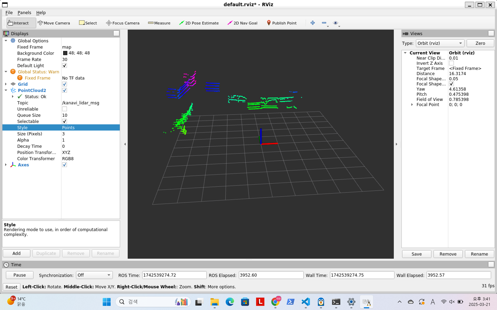
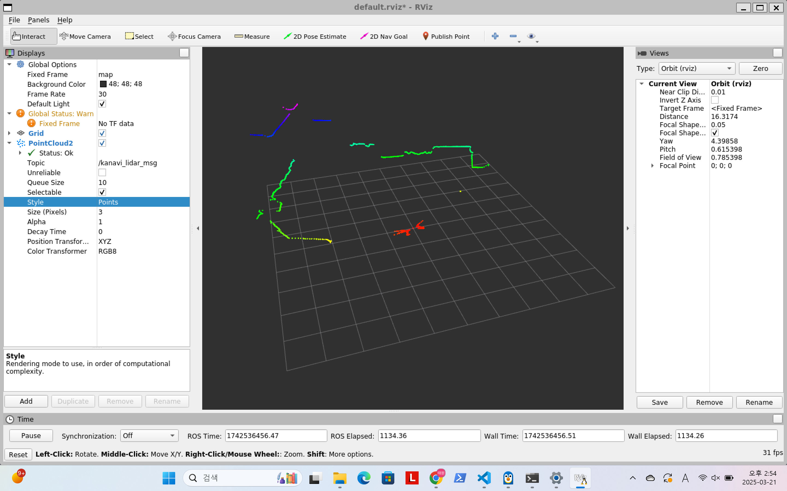
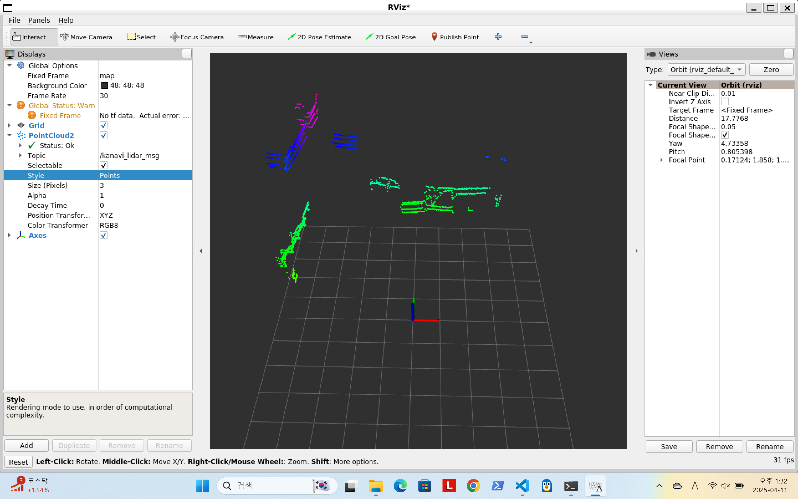
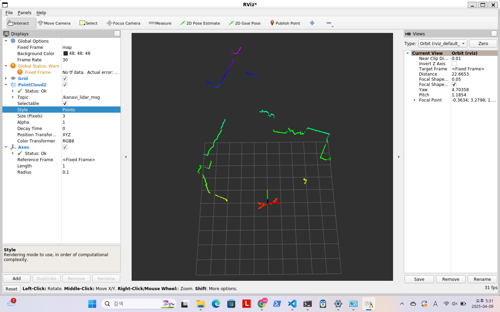

# KANAVI Mobility LiDAR ROS1/ROS Documentation

## 1. 프로젝트 개요

Kanavi Mobility의 LiDAR ROS는 ROS1과 ROS2를 하나의 소스 트리에서 동시에 빌드 및 실행할 수 있도록 구성된 하이브리드 구조입니다.
Kanavi Mobility LiDAR 모델(R2, R4, R270)을 지원하며 UDP를 기반으로로 데이터를 수신하고, ROS1 또는 ROS2 메시지로 퍼블리시합니다.

### 지원하는 OS

- 20.04에서 테스트 완료
- 그 외 버전은 확인 필요

| ROS / Ubuntu | Ubuntu 24.04            | Ubuntu 22.04                  | Ubuntu 20.04                                | Ubuntu 18.04            |
|--------------|--------------------------|-------------------------------|---------------------------------------------|--------------------------|
| **ROS 1**     | -                        | -                             | **Noetic**<br>✅ Tested                      | **Melodic**<br>⚠️ Not Tested |
| **ROS 2**     | **Jazzy**<br>⚠️ Not Tested | **Humble / Iron**<br>⚠️ Not Tested | **Foxy**<br>✅ Tested| -                        |

---

## 2. 소스코드 트리 구조

```bash
directory/
└── src/
    └── kanavi_vl/
        ├── include/
        │   ├── argv_parser.hpp
        │   ├── common.h
        │   ├── kanavi_lidar.h
        │   ├── r270_spec.h
        │   ├── r2_spec.h
        │   ├── r4_spec.h
        │   ├── udp.h
        │   └── kanavi_vl/
        │       ├── ros1/
        │       │   └── kanavi_node.h
        │       └── ros2/
        │           └── kanavi_node.h
        ├── src/
        │   ├── lidar/
        │   │   ├── CMakeLists.txt
        │   │   └── kanavi_lidar.cpp
        │   ├── node_ros1/
        │   │   ├── CMakeLists.txt
        │   │   └── kanavi_node.cpp
        │   ├── node_ros2/
        │   │   ├── CMakeLists.txt
        │   │   └── kanavi_node.cpp
        │   ├── R2/
        │   │   └── main.cpp
        │   ├── R270/
        │   │   └── main.cpp
        │   ├── R4/
        │   │   └── main.cpp
        │   └── udp/
        │       ├── CMakeLists.txt
        │       └── udp.cpp
        ├── CMakeLists.txt
        └── package.xml
```

---

## 3. 파일별 기능 설명

### 루트 파일

- **CMakeLists.txt**: 전체 프로젝트의 빌드 설정
- **package.xml**: ROS 패키지 메타 정보 및 의존성 정의

### include/

- `argv_parser.hpp`: 커맨드라인 파라미터 파서
- `common.h`: 공통 매크로 및 타입 정의
- `kanavi_lidar.h`: LiDAR 처리 클래스 인터페이스
- `r2_spec.h`, `r4_spec.h`, `r270_spec.h`: 모델별 LiDAR 스펙 정의
- `udp.h`: UDP 통신 관련 정의
- `kanavi_node.h` (ros1/ros2): 각각의 ROS 버전에 따른 노드 정의

### src/

- **lidar/kanavi_lidar.cpp**: LiDAR 데이터 처리 구현
- **node_ros1/kanavi_node.cpp**: ROS1 노드 정의
- **node_ros2/kanavi_node.cpp**: ROS2 노드 정의
- **R2/R4/R270/main.cpp**: 모델별 실행 메인 파일
- **udp/udp.cpp**: UDP 통신 처리

---

## 4. 빌드 및 실행 방법

### ROS1 환경

```bash
catkin_make
rosrun kanavi_vl R4 -h
```

### ROS2 환경

```bash
colcon build
ros2 run kanavi_vl R4 -h
```

#### CLI 사용법

프로그램 실행 시 `-h` 옵션을 통해 다음과 같은 도움말이 출력됩니다:

```bash
[HELP]============
-i : set Network Information
    ex) -i [ip] [port]
-m : set multicast IP Address
    ex) -m [multicast ip]
-fix : set fixed frame Name for RViz
-topic : set topic name for RViz
```

##### 📌 파라미터 설명

| 파라미터 이름            | 설명                                     | 예시                             |
|--------------------------|------------------------------------------|----------------------------------|
| `-i`        | 네트워크 IP 및 포트 설정                 | `-i 192.168.0.1 8888`   |
| `-m`            | 멀티캐스트 IP 설정                       | `-m 224.0.0.1`   |
| `-fix`          | RViz에 사용될 fixed frame 이름 지정      | `-fix map`        |
| `-topic`                | ROS에서 퍼블리시할 topic 이름 지정       | `-topic /scan`                  |

> 참고: 파라미터 이름은 `KANAVI::ROS::PARAMETER_***` 상수로 관리됩니다.

### Run Node

#### ROS1

```bash
# R2
rosrun kanavi_vl R2 -i 192.168.123.100 5000 -m 224.0.0.5
# R270
rosrun kanavi_vl R270 -i 192.168.123.100 5000 -m 224.0.0.5 -fix map -topic kanavi_r270_msg
# R4
rosrun kanavi_vl R4 -i 192.168.123.100 5000 -m 224.0.0.5
```

#### ROS2

```bash
# R2
ros2 run kanavi_vl R2 -i 192.168.123.100 5000 -m 224.0.0.5
# R270
ros2 run kanavi_vl R270 -i 192.168.123.100 5000 -m 224.0.0.5 -fix map -topic kanavi_r270_msg
# R4
ros2 run kanavi_vl R4 -i 192.168.123.100 5000 -m 224.0.0.5
```

#### result









---

## 5. 라이선스 관련

본 프로젝트는 BSD 3-Clause License 하에 배포됩니다.  
루트 디렉토리에 `LICENSE` 파일이 포함되어 있습니다.

---
